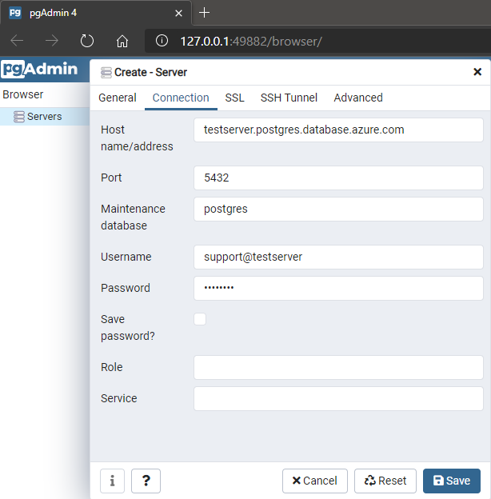
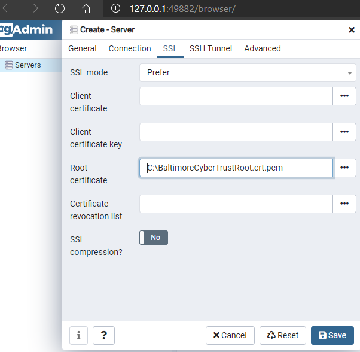

# Connecting to PostgreSQL database

## Creating the Database Server

1. Create a PostgreSQL database from Azure Portal, navigate through the **[create template link](https://portal.azure.com/#create/Microsoft.PostgreSQLServer)**.
2. Select **Single Server** as a Deployment option.
3. Select or create a new ResourceGroup
4. Enter Server name **<alias>-postgresql**
5. Data Source as **None**
6. Select a **Location** and version **10**
7. Configure a **Basic Server with 2 vCores** default config.
8. Enter an admin **username** and **password**.
9. Once the server is created, go under **Settings** option and click on **Connection Security**
10. Allow access to Azure Services and add your **current ip address** to the firewall, clic in **Save**.
11. By default SSL is enforced in PostgreSQL, you need to download the trusted ca certificate at this [reference](https://docs.microsoft.com/en-us/azure/postgresql/concepts-ssl-connection-security#applications-that-require-certificate-verification-for-tls-connectivity) and save it in your local computer since you will need it for the next steps.

## Using client for creating database
1. Download **PGAdmin** and install it from this reference (https://www.pgadmin.org/download)
    - If you are using Windows: https://www.pgadmin.org/download/pgadmin-4-windows/
    - PG admin will listening on `http://127.0.0.1:54756/`
2. Right click on **Servers** and create a new Server.
    - Set a name in **General** tab.
    - In **Connection** tab:
      - Set Host with **`<servername>.postgres.database.azure.com`**
      - Set Username with **`user@servername`**
      - Set Password
        
        


    - In **SSL** tab:
      - Upload the trusted ca certificate into **Root certificate**.
        

3. Click **save** to complete the configuration.
4. Once it is connected, navigate under **Databases**, right-click and create a new database, set a name and click save.

## Connecting Node.js application with PostgreSQL
1. For this example you need **nodejs>8** (Download NodeJS versions from here https://nodejs.org/en/download/) since this sample uses async functions. Clone this repository with `git clone https://github.com/azureossd/nodejs-databases-samples.git`
2. Cd into **nodejs-databases-samples/postgresql** directory.
3. Install libraries with **`npm install`**
4. Set the following environment variables (USER, HOST, DATABASE, PASSWORD)
    - If you are using Windows with **`set HOST=<servername>.postgres.database.azure.com`**
    - If you are using Linux with **`export HOST=<servername>.postgres.database.azure.com`**
5. Run the sample with **`node server.js`** and browse to **`http://localhost:3000`**
6. To deploy to Azure, create a new Azure Web App NodeJS Linux from portal, preferably to be with any Node LTS version.
7. Set up **Local Git** and copy your local git url.
8. Click on **Configuration** and add the following Application Settings (USER, HOST, DATABASE, PASSWORD) with values.
9. Run the following commands:
  ```bash
    git init
    git add .
    git commit -m "Initial Commit to Azure"
    git remote add azure https://<sitename>.scm.azurewebsites.net:443/<sitename>.git
    git push azure master
  ```
>Note: If you have set up your deployment user before use that you can use that user and password, otherwise you can use publish profile.
10. Browse to the site `https://<sitename>.azurewebsites.net/` to see all operations for this application.
